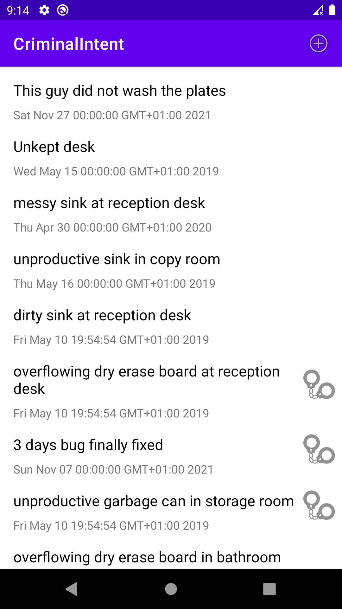
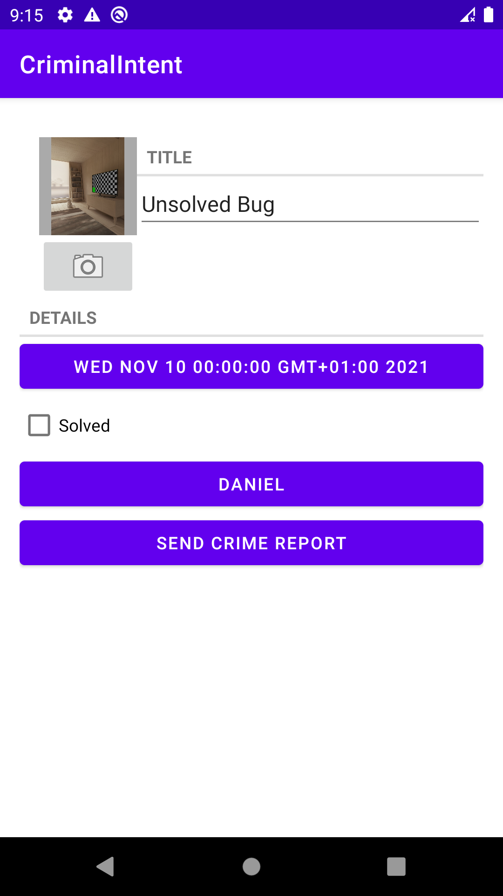
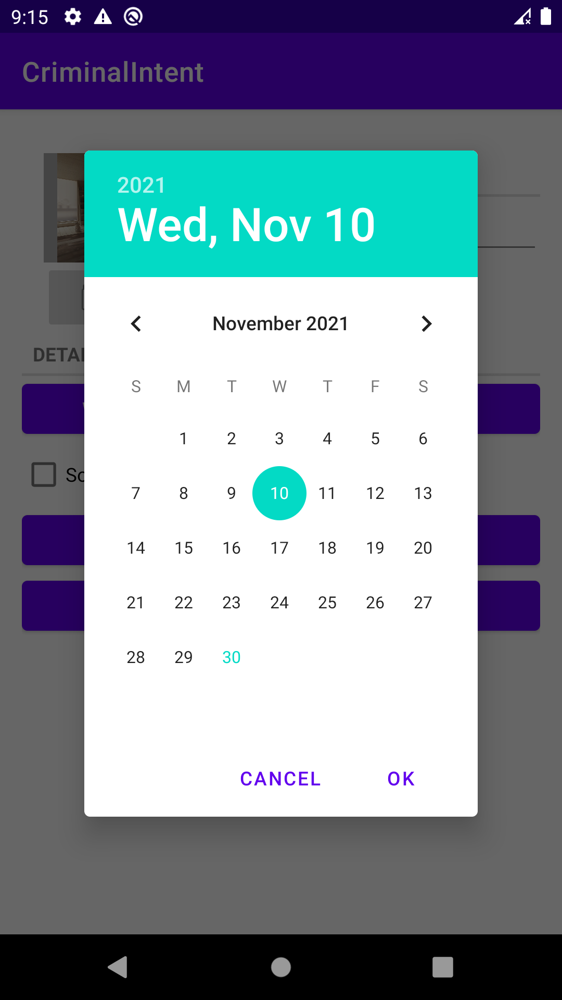

# Criminal Intent

A fun App to report crimes in your office.

# Description

Criminal Intent is a fun project that keeps records the details of “office crimes” – things like leaving dirty dishes in the break room sink or walking away 
from an empty shared printer after documents have printed.
With CriminalIntent, you can make a record of a crime including a title, a date, and a photo. You can also identify a suspect from your contacts and lodge a complaint via email, Twitter, Facebook,
or another app. After documenting and reporting a crime, you can proceed with your work free of
resentment and ready to focus on the business at hand.

## Screenshots

